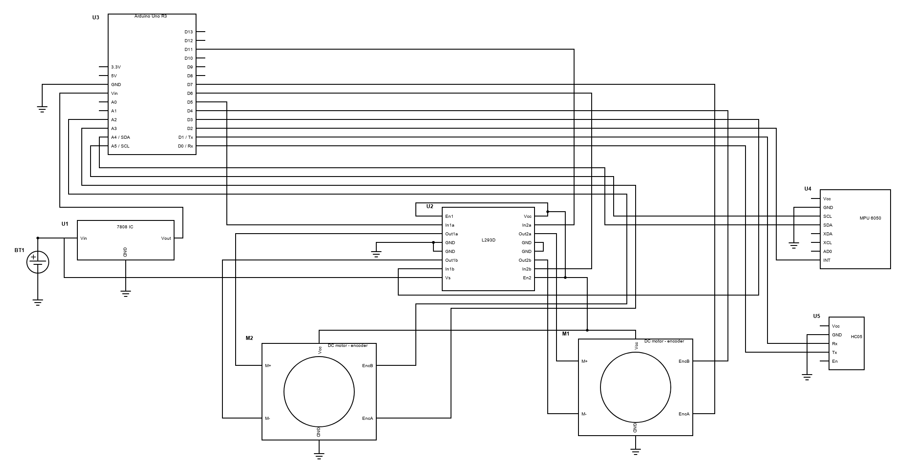

# Self Balancing Robot

<table>
  <tr>
    <td>   </td>
    <td>   </td>
  </tr>
</table>
Fig 1. Self balancing robot construction and working -- side and front views.


## Description
This repository outlines the implementation of a self balancing robot that uses a kalman filter for angle estimation and an android mobile application for robust control.

<figure>
    
    <figcaption>Fig 2. Balancing action of the self balancing robot</figcaption>
</figure>
<br><br>
<figure>
    
    <figcaption>Fig 3. Android mobile application control interface.</figcaption>
</figure>

## Getting Started

### Dependencies
* Arduino IDE = 1.8
* Arduino Uno development board

### Installing
```
  git clone https://github.com/Aaatresh/self-balancing-robot
```

### Circuit diagram


### Controlling the robot and executing the program

Construction and working:
* Construct the robot chassis and create a PCB according to the given circuit diagram.
* Compile and load the one of the C codes onto an arduino Uno development board.
* Install the ard_bt_controller mobile application onto an android device using its apk file.

## Authors
* Anirudh Ashok Aatresh ([anirudhashokaatresh@gmail.com](mailto:anirudhashokaatresh@gmail.com))

## Version History
* 1.0
    * Initial Release

## License
This project is licensed under the MIT License - see the LICENSE.md file for details.

## Acknowledgments
* I would like to thank automaticaddison.com for assistance with the kalman filter implementation.
